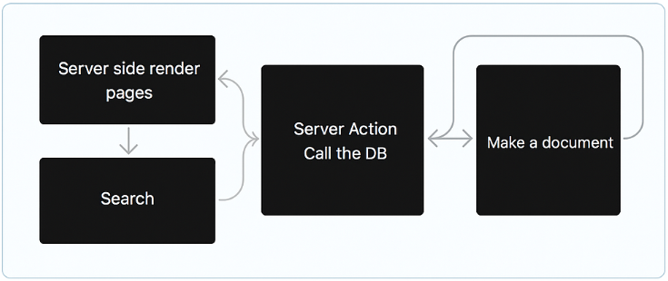
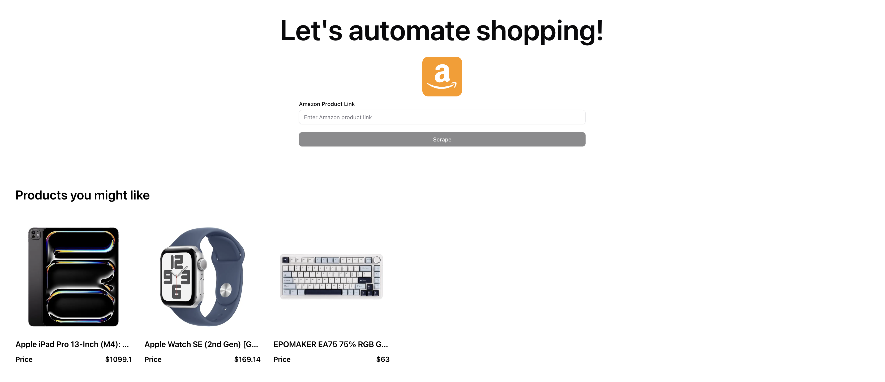

# AI powered Amazon Scraping to Automate Shopping SaaS 👾

## NextJS full stack app

<p align="center">
  
</p>

## Description

This project is a web application built with Next.js designed to scrape Amazon product data, track prices, and automate shopping tasks. It allows users to monitor product prices, receive email notifications for price drops and other events, while simplifying raw product descriptions. The application utilizes server-side actions, cron jobs, and a MongoDB database for data persistence and automated operations.

## SaaS Page



## Features

- **Amazon Product Scraping:** Scrapes product data from Amazon using Cheerio and axios.
- **Price Tracking and Monitoring:** Tracks and monitors product prices over time.
- **Email Notifications:** Sends email notifications for price drops, stock changes, and other events using Nodemailer.
- **Product Description Simplification:** (Potentially) Simplifies product descriptions using an LLM.
- **User Interface:** Provides a user interface for managing tracked products and notification settings.
- **Automated Data Updates:** Utilizes scheduled cron jobs for automated data updates.
- **Server-Side Actions:** Employs server-side actions for secure data handling.
- **Data Persistence:** Uses MongoDB for storing product information and tracking data.

## Installation

To set up and run this project, follow these steps:

1.  **Clone the repository:**

    ```bash
    git clone <repository_url>
    cd amazon-scraping-to-automate-shopping
    ```

2.  **Install dependencies:**

    ```bash
    npm install
    ```

3.  **Environment Variables:**

    - Create a `.env.local` file in the root directory.
    - Define the following environment variables:
      - `MONGODB_URI`: Your MongoDB connection string.
      - `BRIGHT_DATA_USERNAME`: Your Bright Data username (for proxy).
      - `BRIGHT_DATA_PASSWORD`: Your Bright Data password (for proxy).
      - `NODEMAILER_EMAIL`: Your email address for sending notifications.
      - `NODEMAILER_PASSWORD`: Your email password or app password.

4.  **Database Setup:**

    - Ensure you have a MongoDB database set up and accessible.
    - The application will create necessary collections and populate them as needed.

## Usage

1.  **Running the Development Server:**

    ```bash
    npm run dev
    ```

    This will start the Next.js development server. You can then access the application in your browser, typically at `http://localhost:3000`.

2.  **Scraping a Product:**

    - The application likely provides a form to input an Amazon product URL. Submit the URL to initiate the scraping process.

3.  **Viewing Product Details:**

    - The application will display product details, including the scraped price.

4.  **Setting Up Notifications:**

    - There's a mechanism to configure email notifications. You'll be able to specify notification preferences based on price drops, etc with node cron.

5.  **Cron Job Functionality (Automated Updates):**

    - The `app/api/cron/route.ts` file indicates the presence of a cron job. This is likely set up to run periodically (e.g., every hour) to scrape product data and update the database. The cron job's behavior is managed by the `next.config.ts` file. You will need to configure your deployment environment (e.g., Vercel, Netlify) to run serverless functions or cron jobs to ensure the cron job runs.

## Tech Stack and Dependencies

- **Frontend:**
  - Next.js (React)
  - Tailwind CSS
  - React Hook Form
  - Radix UI
  - Lucide React
  - Sonner
- **Backend:**
  - Node.js
  - TypeScript
  - Mongoose (MongoDB ODM)
  - MongoDB
  - Axios (HTTP requests)
  - Cheerio (HTML parsing)
  - Next Safe Action
  - Nodemailer
  - @google/genai, @google/generative-ai (Description simplification)

## Project Structure Overview

- `app/`: Contains the Next.js application pages and components.
  - `app/api/`: API routes for server-side functions.
    - `app/api/cron/route.ts`: Cron job endpoint for scheduled tasks.
    - `app/api/simplify-description/route.ts`: API endpoint for description simplification.
  - `app/products/`: Contains product-related pages.
  - `app/products/[id]/page.tsx`: Dynamic route for individual product pages.
  - `app/layout.tsx`: Defines the application layout.
  - `app/page.tsx`: The main application page.
- `components/`: Reusable React components.
  - `components/hero-section/`: Components for the hero section.
  - `components/products/`: Components related to product display and interaction.
  - `components/ui/`: UI components (buttons, forms, etc.).
- `lib/`: Utility functions and helper modules.
  - `lib/nodemailer/`: Nodemailer configuration and email generation.
  - `lib/scraper/`: Scraping logic using Cheerio and Axios.
  - `lib/utils.ts`: Utility functions.
- `server/`: Server-side code.
  - `server/models/`: Mongoose models.
  - `server/actions/`: Server actions for data manipulation.
- `types/`: TypeScript type definitions.
- `public/`: Static assets (images, icons).
- `Reactbits/`: External React components (e.g., SplitText, ShinyText).
- `next.config.ts`: Next.js configuration file.
- `postcss.config.mjs`: PostCSS configuration file.
- `tsconfig.json`: TypeScript configuration file.

## Contributing

Contributions are welcome! To contribute:

1.  Fork the repository.
2.  Create a new branch for your feature or bug fix.
3.  Make your changes and commit them.
4.  Submit a pull request.

## License

This project is licensed under the MIT License. See the [LICENSE](LICENSE) file for details.
